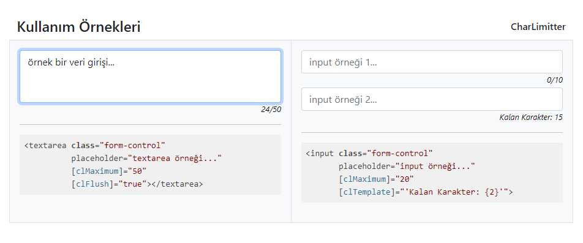

# AngularCharLimitter

`Textarea` veya `Input` alanlarına girilen karakterleri sayar ve limitler.
[Directive](https://angular.io/guide/attribute-directives) olarak eklenir.

## Development server

This project was generated with [Angular CLI](https://github.com/angular/angular-cli) version 12.2.10.
* Run `ng build` to build the project.
* Run `ng serve` for a dev server.
* Navigate to `http://localhost:4200/`.

